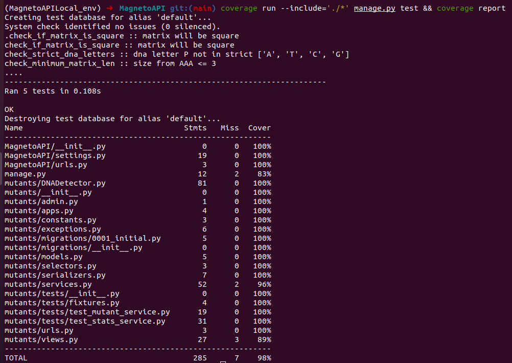

# MagnetoAPI


## Context
This project allows to identify if DNA sequence is a mutant or human.
The app is deploy in AWS:
   

For resolve the problem is used the method "is_mutant()" in class "DNADetector"([Main Method](./mutants/DNADetector.py)),
this go through the matrix by every element as inspect the right, down, right_diagonal and
left_diagonal for found 3 same letters conincidences.


## Usage
URL = https://g5zq66isz7.execute-api.us-east-1.amazonaws.com/dev

1. ### Check dna sequence 
    ```sh
    [POST] https://g5zq66isz7.execute-api.us-east-1.amazonaws.com/dev/api/v1/mutant
    ```
    
    #### Mutant example
    [BODY] 
    ```json
    {
        "dna": ["ATGCGA", "CAGTGC", "TTATGT", "AGAAGG", "CCCCTA", "TCACTG"]
    }
    ```
   [RESPONSE] -> HTTP_200_OK
    
    #### Human example
    [BODY] 
    ```json
    {
        "dna": ["AAAACC", "GTGTGT", "ACACAC", "GTGTGT", "ACACAC", "GTGTGT"]
    }
    ```
   [RESPONSE] -> HTTP_403_FORBIDDEN
   
2. ### Get stats
    ```sh
    [GET] https://g5zq66isz7.execute-api.us-east-1.amazonaws.com/dev/api/v1/stats
    ```

    [RESPONSE] 
    ```json
    {
        "count_mutant_dna": 40,
        "count_human_dna": 100,
        "ratio": 0.4
    }
    ```

## Unit Tests And Coverage

1. For run the tests and get coverage (see in mutants/tests/):
    ```sh
    >>(Env)[DirProject] coverage run --include='./*' manage.py test && coverage report
    ```
   


## Tech
The technologies used for this project were the following:
* [Python3]
* [Django]
* [MySQL]
* [AWS]
* [zappa] https://github.com/Miserlou/Zappa
